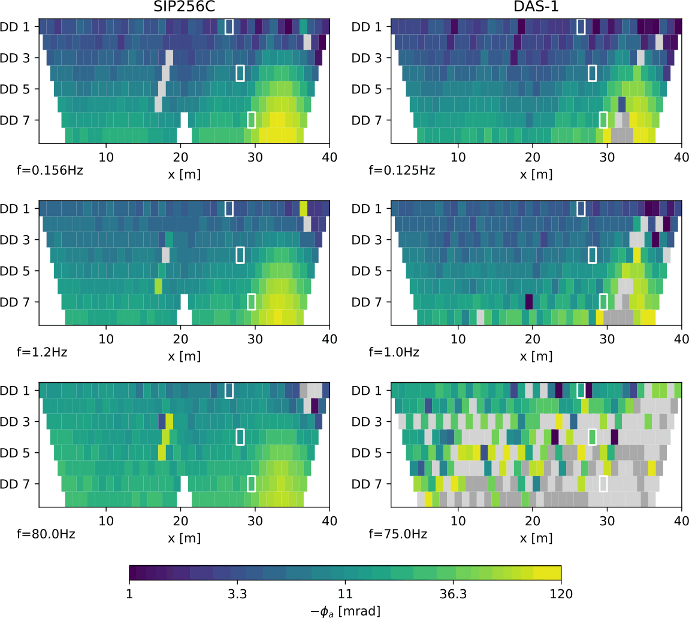
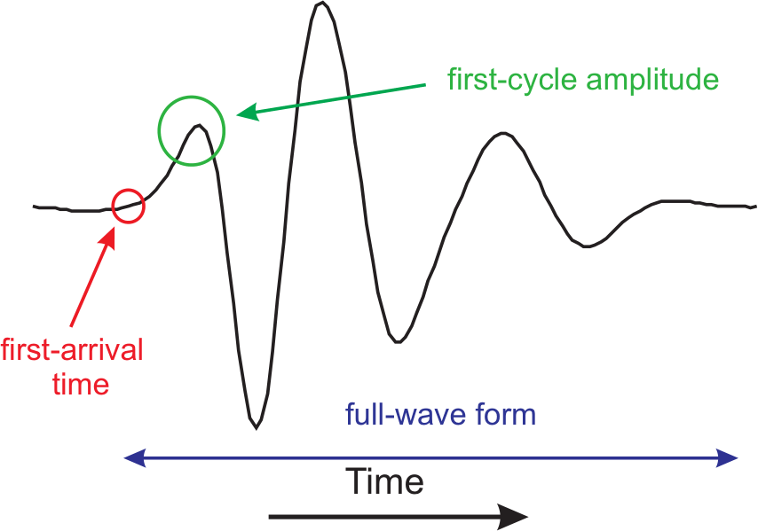
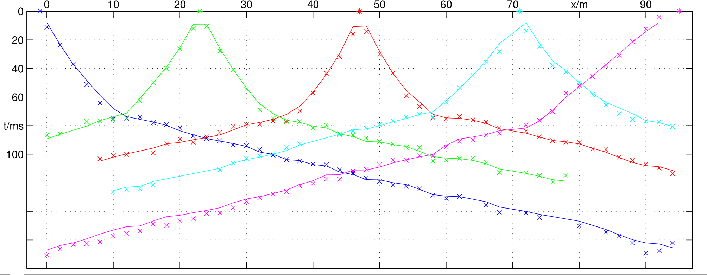
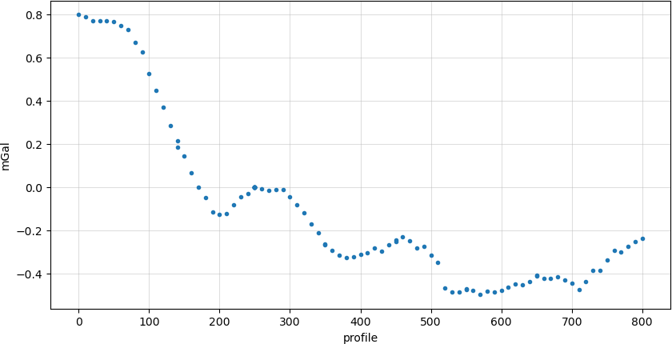
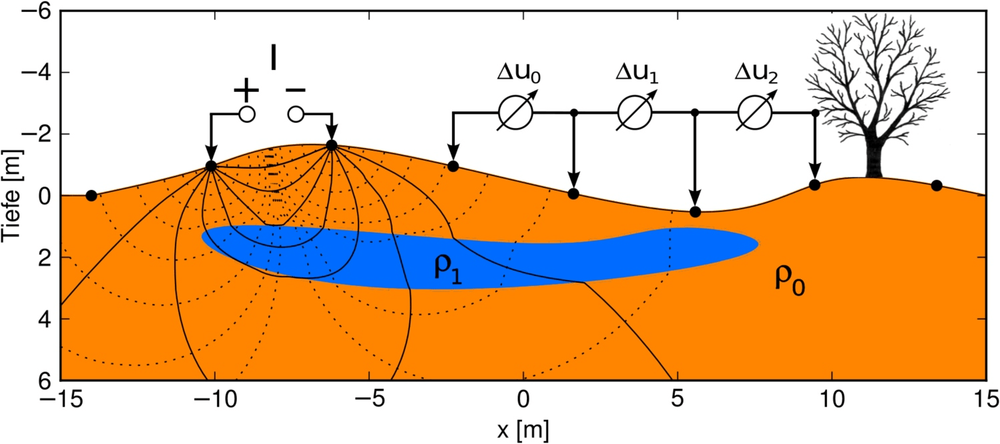
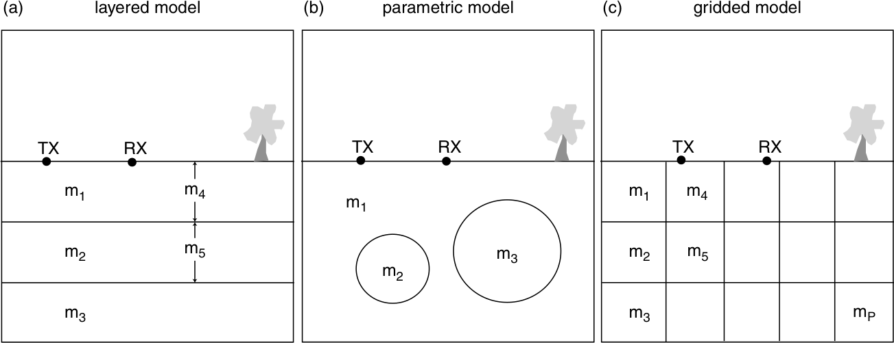

## Data

In geophysics, we measure many different types of data depending on the physical method being used.

:::: {.columns}
::: {.column}

:::
::: {.column}
* left: ERT/IP pseudosections for different frequencies
* single values
* often arranged logically view on data important
* sometimes associated to space
:::
::::

### Data in seismology
time series of acceleration, velocity or position

### Data in travel-time tomography
traveltimes between shot and geophones

### Data in gravimetry

### Data in electrical resistivity tomography (ERT)
current and voltage combinations

### Data organization
- can be a discretized function of space, time or frequency, and plotted as such (curves)
- can depend on several sensor (shot/geophone, ABMN) and visualized as several curves or a coloured matrix (crossplot, pseudosection)

Data are subsumed in the *data vector*
$$\textbf{d}=[d_1, d_2, \ldots, d_N]^T$$
consist of true *model response* $\bf f(m)$ plus *noise* $\bf n$: $\bf d=f(m)+n$

## Geophysical Workflow

:::: {.columns}
::: {.column}
1. Data acquisition
2. Preprocessing (QC, filtering)
3. Parameterization (mesh)
4. **Inversion**
5. Fit of data & model response
6. Postprocessing & visualization
7. Interpretation
:::
::: {.column}
{.fragment}
:::
::::

## Model

- numerical parameterization of subsurface (our assumption)

### Model types

subsurface described by *model vector* $\textbf{m}=[m_1, m_2, \ldots, m_M]^T$

**Independent parameters:**

- seismology: earthquake location, stress, principal axis
- gravity: position and depth of anomaly, size, density contrast
- spectroscopy (e.g. SIP): function parameters (e.g. Cole-Cole)
- layered model thicknesses and values ($\rho$, $v$)

subsurface described by *model vector* $\textbf{m}=[m_1, m_2, \ldots, m_M]^T$

***Discrete functions of space, time, frequency***

(same property aligned along axes)

- refraction: depth (and velocity) of refractor
- distribution of a parameter in space (and time)
- spectroscopy: Fourier or Debye distribution
- e.g. 2D/3D resistivity/velocity/density distribution

## Inversion

::: {.callout-note title="Inverse problem: determine $\vb m$ so that data are explained"}
$$ \vb d \approx \vb f(\vb m) $$
:::

::: {.callout-note title="Why not"}
$$ \vb d = \vb f(\vb m) $$

Because $\vb d$ contains random noise not to be explained.
:::

### Minimization problem

::: {.callout-note title="The (data) objective function"}
$$ \Phi_d=\|{\vb d - f(m)}\|^2_2 = \sum_i^N (d_i-f_i(\vb m))^2 \rightarrow \min $$

Take into account errors: Explain model within error ($\boldsymbol{\epsilon}$) bounds
$$ \Phi_d = \| \frac{\vb d-f(m)}{\boldsymbol{\epsilon}}\|^2_2 = \sum_i^N \left(\frac{d_i-f_i(\vb m)}{\epsilon_i}\right)^2 \| \rightarrow \min $$

error model $\boldsymbol{\epsilon}=[\epsilon_1, \epsilon_2, \ldots, \epsilon_N]^T$ (assumption of noise standard deviation)
:::

### Correctness
:::: {.columns}
::: {.column}

::: {.callout-note title="Well-posed problems (Hadamard)"}
* There is a solution,
* it is uniquely defined &
* depends steadily from input data (small variations lead to small model deviations)
:::

:::
::: {.column}
::: {.callout-important title="Ill-posed problem"}
* There is no model to fit the data perfectly
* Many models can fit the data within errors
* Small data variations can lead to large model deviations
:::
:::
::::

### Occam's razor - a fundamental rule

::: {.callout-important title="novacula Occami"}
Pluralitas non est ponenda sine neccesitate!

(William of Ockham, Scottish philosopher and theologian, 14th century)
:::

::: {.callout-note title="Principle of Parsimony"}
Entities must not be multiplied beyond necessity.

Of two competing theories, the simpler explanation is to be preferred.

From all models fitting the data, choose the simplest!
:::
