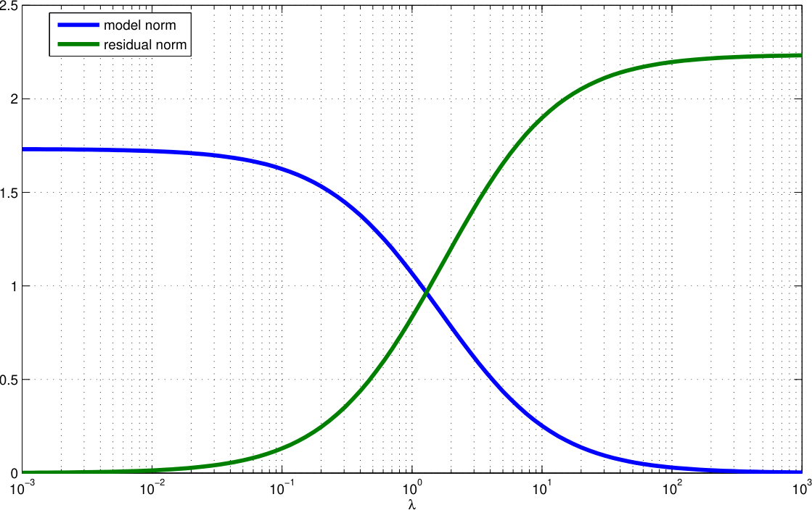
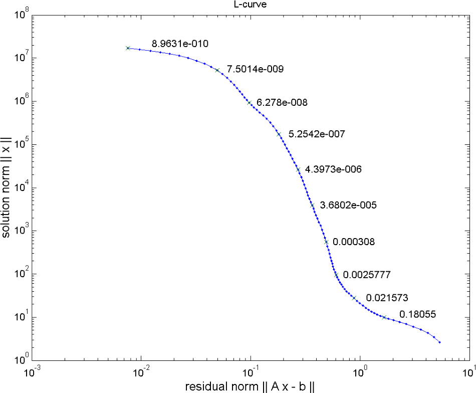

## Regularization basics

* making under-determined and ill-posed problems unique (regular)
* make the model less sensible to small changes (noise) in data
* adding our assumptions or knowledge (valid ranges, prior data, geostatistical behaviour, interfaces)

::: {.callout-note title="Occams razor"}
Of all possible models, choose the simplest! How to define simple?
:::

In total, we are adding equations to the underdetemined system:

$$ \vb G = \mqty(1 & 1 & 0 \\ 0 & 0 & 1) \Rightarrow \tilde{\vb G} $$

* $d_1$ measures the mean value of $m_1$ and $m_2$

::: {.fragment}
* size of subvector [$m_1$, $m_2$] should be small

$$ \tilde{\vb G} \vb m =\mqty(1 & 1 & 0 \\
                              0 & 0 & 1\\
                    \textcolor{red}1 & 0 & 0 \\
                    0 & \textcolor{red}1 & 0)
                    = \mqty(d_1\\ d_2\\0\\0) $$
:::

There is a couple of different choices

### Minimum norm solution

All model parameters are expected to be (similarly) small

$$ \tilde{\vb G}\vb m=\mqty(1 & 1 & 0 \\
                    0 & 0 & 1\\
                    1 & 0 & 0\\
                    0 & 1 & 0\\
                    0 & 0 & 1) \vb m =
                    \mqty(d_1\\ d_2\\ d_3\\ d_4\\ d_5) =
                    \mqty(d_1\\ d_2\\ m^P_1\\ m^P_2\\ m^P_3)
                    $$

or close to some prior knowledge ($d_3$, $d_4$, $d_5$)

## Regularization basics: adding equations

$$ \vb G = \mqty(1 & 1 & 0 \\ 0 & 0 & 1) \tilde{\vb G}$$

* we only measure the mean value of $m_1$ & $m_2$ (as well as $m_3$)

::: {.fragment}
* difference between $m_1$ and $m_2$ should be small

$$ \tilde{\vb G} \vb m=\mqty(1 & 1 & 0 \\
                             0 & 0 & 1\\
                    \textcolor{red}{-1} & \textcolor{red}1 & 0)
                    = \mqty(d_1\\ d_2\\0) $$
:::

## Smoothness constraints

Gradient (roughness) between neighboring model parameters

$$ \tilde{\vb G} \vb m = \mqty(1 & 1 & 0 \\
                    0 & 0 & 1\\
                    -1 & 1 & 0\\
                    0 & -1 & 1)
                    = \mqty(d_1\\ d_2\\0\\ 0) $$

## Regularization scheme

$\tilde{\vb G}$ consists of forward part & constraints part

$$ \tilde{\vb G}=\mqty[\vb G \\ \vb C] \quad\text{and}\quad \tilde{\vb d} = \mqty[\vb d \\ \vb c] $$

now over-determined $\Rightarrow$ least-squares solution $(\tilde{\vb G}^T\vb G)^{-1}\tilde{\vb G}^T \tilde{\vb d}$

$$ \tilde{\vb G}^T \tilde{\vb G} = \vb G^T \vb G + \vb C^T \vb C \quad,\quad
\tilde{\vb G}^T \tilde{\vb d}= \vb G^T \vb d + \vb C^T \vb c $$

$$ \vb m = (\vb G^T \vb G + \vb C^T \vb C)^{-1} (\vb G^T \vb d + \vb C^T \vb c) $$

## Weighting data vs. constraints

$\vb d$ & $\vb c$ may have completely different magnitudes & physical units, data/constraints maybe too weak or too strong  $\Rightarrow$ weighting of constraints by regularization parameter $\lambda$:

$$ \Phi = \|\vb G \vb m - \vb d\|^2 + \lambda \|\vb C \vb m - \vb c \|^2 = \Phi_d + \lambda\Phi_m \rightarrow \min $$

$\lambda$..regularization strength, $\Phi_d$/$\Phi_m$..data/model objective function

$$ \Rightarrow \vb m = (\vb G^T \vb G + \lambda \vb C^T \vb C)^{-1} (\vb G^T \vb d + \lambda\vb C^T \vb c) $$

## Interpretation as constrained minimization (Lagrangian)

$$ \Phi = \|\vb G \vb m - \vb d\|^2 + \lambda \|\vb C \vb m - \vb c \|^2 \rightarrow \min $$

$$ \tilde\Phi = \|\vb C \vb m - \vb c \|^2 + \mu \|\vb G \vb m - \vb d\|^2 = \Phi_m+\mu\Phi_d \rightarrow \min $$

Minimize regularization term under constraint (Lagrangian method)

::: {.callout-tip title="Interpretation with Occam"}
Minimize the non-simplicity subject to $\Phi_d$ reflects noise
:::

## Model and data norms

## The L-curve

:::: {.columns}
::: {.column width="55%"}

:::
::: {.column width="45%"}
Data vs. model norm for wide range of $\lambda$

* low data residual achieved by high norm (oscillating model)
* low model norm cannot fit the data (large misfit)
* optimum somewhere "at the corner" (not always a corner)
:::
::::

## Choice of regularization strength

::: {.callout-tip title="Always have a look at your data fit and model plausibility."}

:::

* use different values and look at models (and misfit)
* try to determine the corner of the L-curve (maximum curvature)
* start large $\lambda$, decrease & stop when data misfit show no systematics

::: {.callout-note title="Discrepancy principle"}
Choose the highest $\lambda$ value that is able to fit the data ($\chi^2$=1)!
:::

## Damped normal equations and SVD

$$ \vb C = \vb I, \vb c=0 \quad\Rightarrow\quad \vb m = (\vb G^T\vb G + \lambda \vb I)^{-1} \vb G^T \vb d $$

$$ \vb m = (\vb V \vb \Sigma \vb U^T \vb U \vb \Sigma \vb V^T + \lambda \vb I)^{-1} \vb V \vb \Sigma \vb U^T \vb d $$

$$ \vb m = (\vb V \mbox{diag}(s_i^2+\lambda) \vb V^T + \lambda \vb I)^{-1} \vb V \vb \Sigma \vb U^T \vb d $$

$$ \vb m = \sum\limits_i^r \frac{s_i}{s_i^2+\lambda} \vb u_i^T \vb d \cdot v_i^T = \sum\limits_i^r \frac{s_i^2}{s_i^2+\lambda} \frac{\vb u_i^T \vb d}{s_i} v_i^T $$

Small singular values are damped in inversion, large unchanged

## Resolution of regularized inverse problems

For $c=0$ we have $\vb G^\dagger=(\vb G^T \vb G + \lambda \vb C^T \vb C)^{-1} \vb G^T$

$$ \Rightarrow \vb R^M=\vb G^\dagger \vb G=(\vb G^T \vb G + \lambda \vb C^T \vb C)^{-1} \vb G^T \vb G $$

approaches $\vb I$ for $\lambda\rightarrow 0$ and deviates if $\lambda$ grows

## Wrap up

* SVD provides a general tool, BUT:
  - ill-conditioned inverse problems (SV spectrum) tend to amplify noise
  - truncated SVD is a method so suppress this
* regularization can (also) be done to make solution unique
* different strategies: smoothness, norm, ...
* choice of regularization strength $\lambda$ is vital

# Application

## Damped least squares and SVD

$$ \vb m = (\vb G^T\vb G + \lambda \vb I)^{-1} \vb G^T \vb d $$

$$ \vb m = (\vb V \vb \Sigma \vb U^T \vb U \vb \Sigma \vb V^T + \lambda \vb I)^{-1} \vb V \vb \Sigma \vb U^T \vb d $$

$$ \vb m = (\vb V \mbox{diag}(s_i^2+\lambda) \vb V^T)^{-1} \vb V \vb \Sigma \vb U^T \vb d $$

$$ \vb m = \sum\limits_i^r \frac{s_i}{s_i^2+\lambda} \vb u_i^T \vb d \cdot \vb v_i = \sum\limits_i^r \frac{s_i^2}{s_i^2+\lambda} \frac{\vb u_i^T \vb d}{s_i} \vb v_i = \sum\limits_i^r f_i \frac{\vb u_i^T \vb d}{s_i} \vb v_i $$

Small singular values are damped by filter factors $f_i=s_i^2/(s_i^2+\lambda)$

## Filter factors

## Inversion with damping
::: {.r-stack width="120%"}

{.fragment}

{.fragment}

{.fragment}

{.fragment}

{.fragment}

{.fragment}

{.fragment}

{.fragment}

{.fragment}
:::

## Choosing $\lambda$: Data and model norm

## The L-curve

## Resolution of regularized inverse problems

For $c=0$ we have $\vb G^\dagger=(\vb G^T \vb G + \lambda \vb C^T \vb C)^{-1} \vb G^T$

$$ \Rightarrow \vb R^M=\vb G^\dagger \vb G=(\vb G^T \vb G + \lambda \vb C^T \vb C)^{-1} \vb G^T \vb G $$

approaches $\vb I$ for $\lambda\rightarrow 0$ and deviates if $\lambda$ grows

## Resolution for damped normal equations

$$ \vb R^M = \vb V \cdot \mbox{diag}(f_i) \cdot \vb V^T $$

$$ \vb R^D = \vb U \cdot \mbox{diag}(f_i) \cdot \vb U^T $$

<!-- with $f_i=\frac{s_i^2}{s_i^2+\lambda}$ (damping of contributions from higher eigenvectors) -->

$\Rightarrow$ like for TSVD with $f_i=[1, \ldots, 1, 0, \ldots, 0]^T$

$$ \vb R^M = \vb V_p \vb V_p^T \quad\mbox{and}\quad \vb R^D = \vb U_p \vb U_p^T $$

$$ \vb R^M-\vb I = \vb V_p \vb V_p^T - \vb V \vb V^T = -\vb V_0 \vb V_0^T $$

<!-- ## Resolution and the null space -->

## Inversion with smoothness constraints
::: {.r-stack width="120%"}

{.fragment}

{.fragment}

{.fragment}

{.fragment}

{.fragment}

{.fragment}

{.fragment}

{.fragment}

{.fragment}
:::

## Smoothness constraints: Data and model norm

## Smoothness constraints: The L-curve

