::: {.callout-note title="Regularization is key to subsurface imaging "}
:::

$\Rightarrow$ Add any information about the subsurface:

- correlation lengths and angles
- structural boundaries (from boreholes, seismics, GPR)
- point information (samples, borehole logs, )
- limits of the possible parameters (e.g. positivity, natural bounds)

## Smoothness constraints

:::: {.columns}
::: {.column}
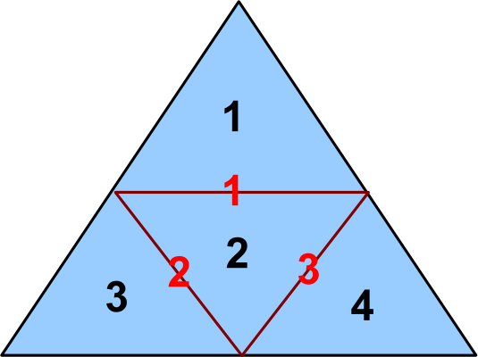

4 model cells, 3 boundaries
:::
::: {.column}
1st order derivative
$$ \vb C = \mqty(-1 & 1 & 0 & 0\\0 & -1 & 1 & 0\\0 & -1 & 0 & 1) $$
can be weighted by

* inverse midpoint distance
* boundary size (length, area)
* information about boundaries
:::
::::

## Anisotropic smoothness

:::: {.columns}
::: {.column}
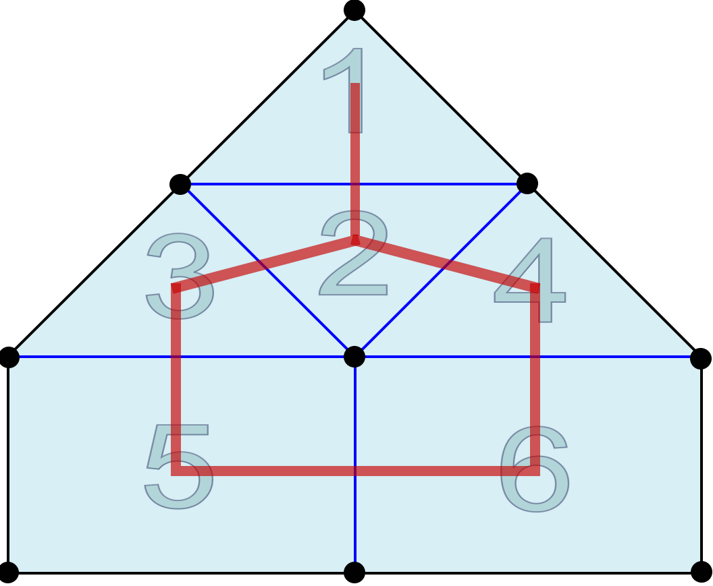
:::
::: {.column}
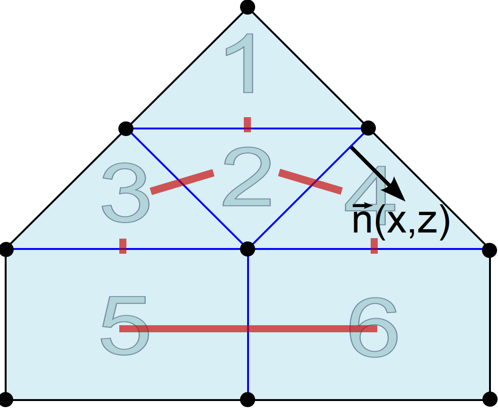{.fragment}
:::
::::

## Structural decoupling

:::: {.columns}
::: {.column}

:::
::: {.column}
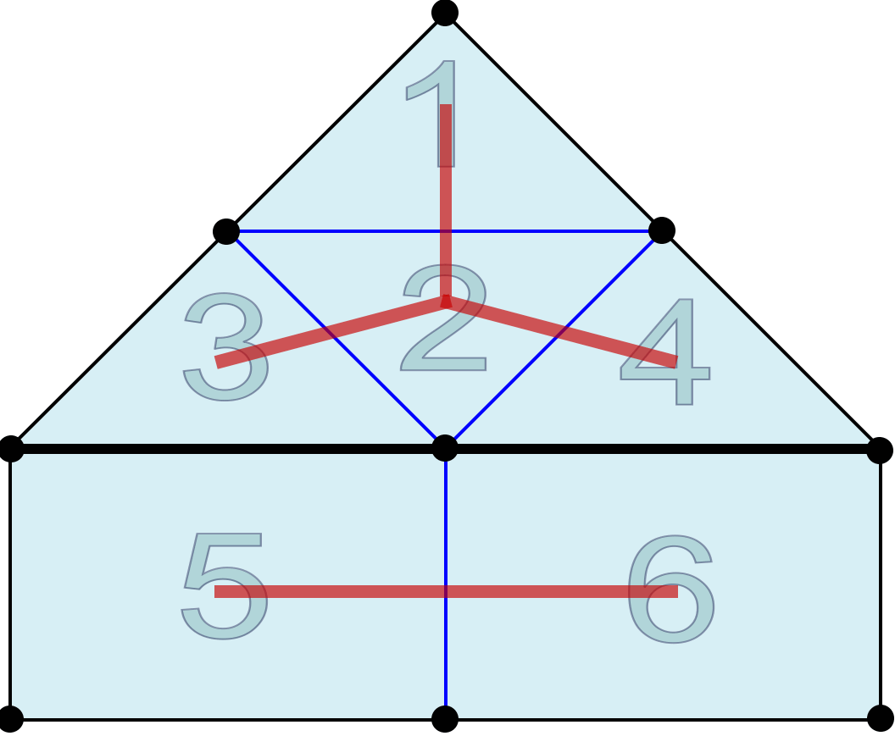
:::
::::

## Structural constraints

:::: {.columns}
::: {.column width="30%"}
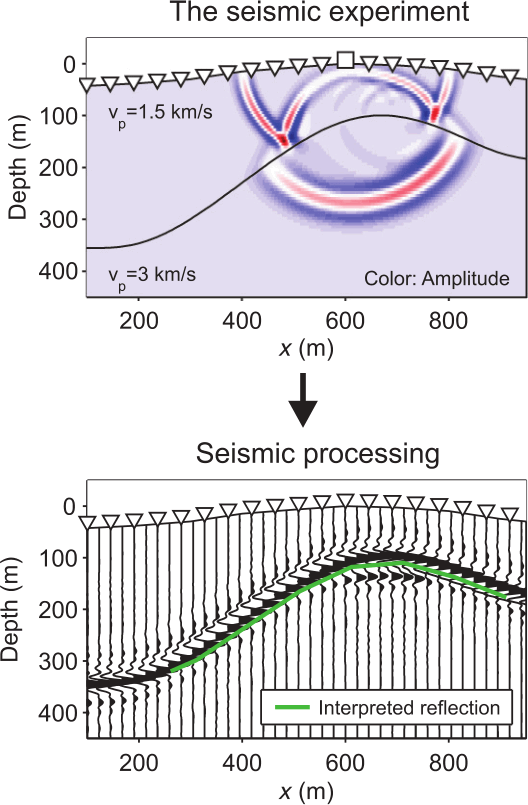
:::
::: {.column width="67%"}
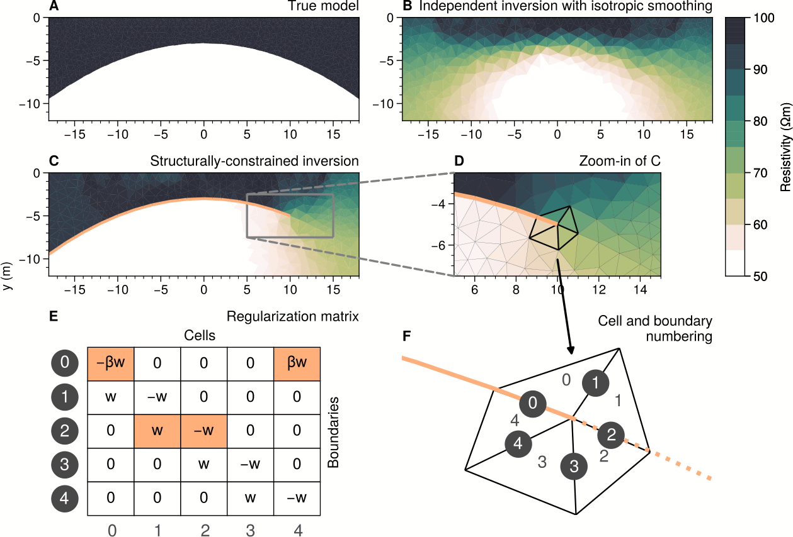{.fragment}
:::
::::

## Structural example (Tanner et al. 2020)

:::: {.columns}
::: {.column width="48%"}
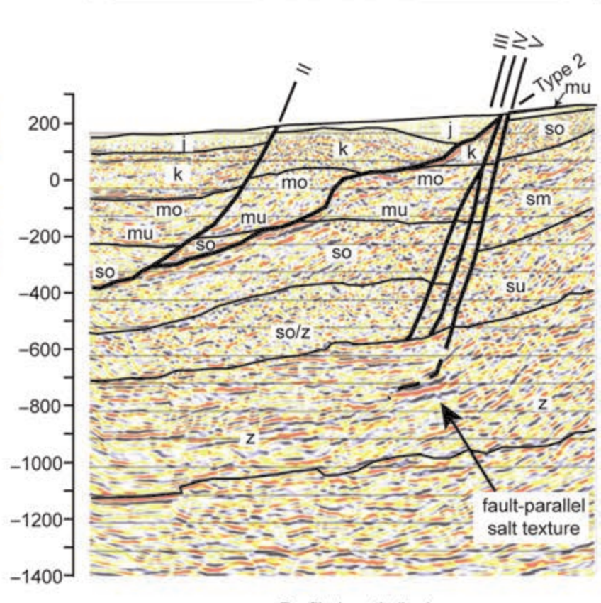
:::
::: {.column width="48%"}
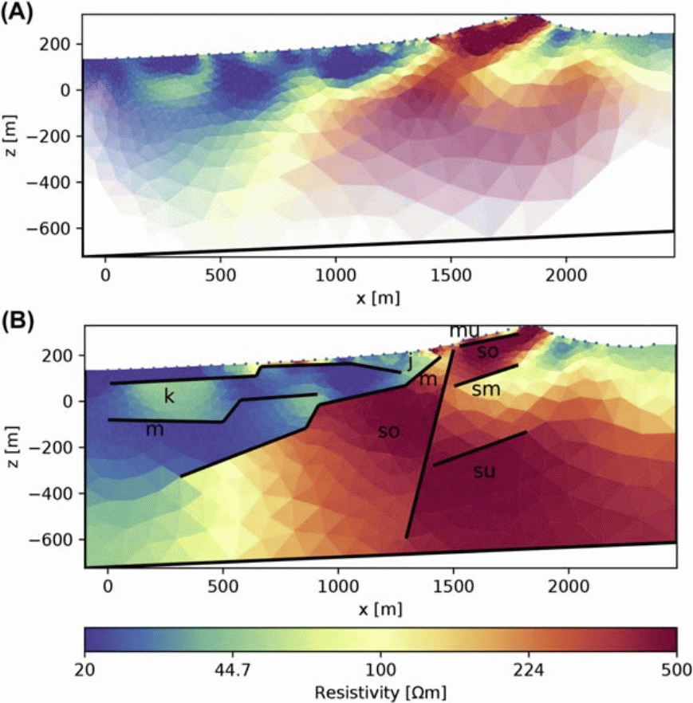
:::
::::

## Selected smoothness
:::: {.columns}
::: {.column}

:::
::: {.column}
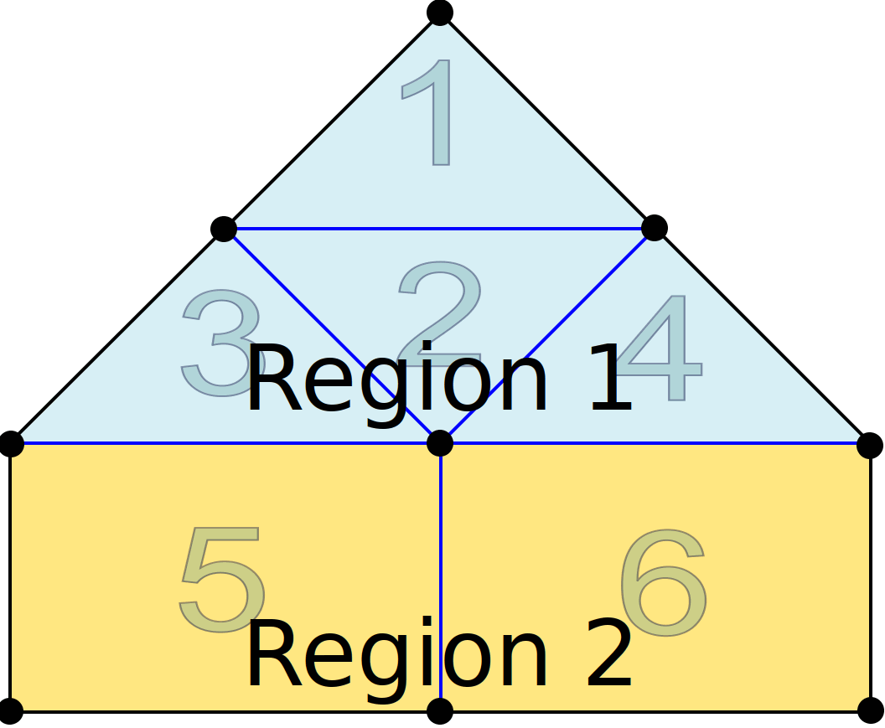{.fragment}
:::
::::

## Model reduction
:::: {.columns}
::: {.column}
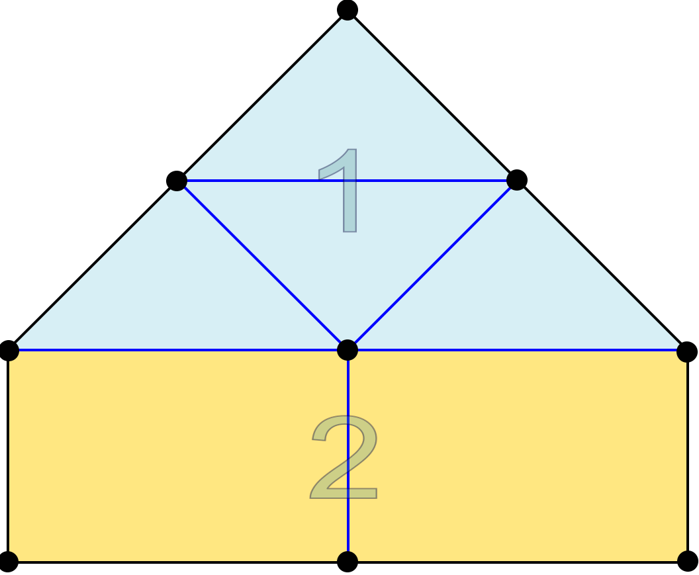
:::
::: {.column}

:::
::::

## Region-wise settings

:::: {.columns}
::: {.column}
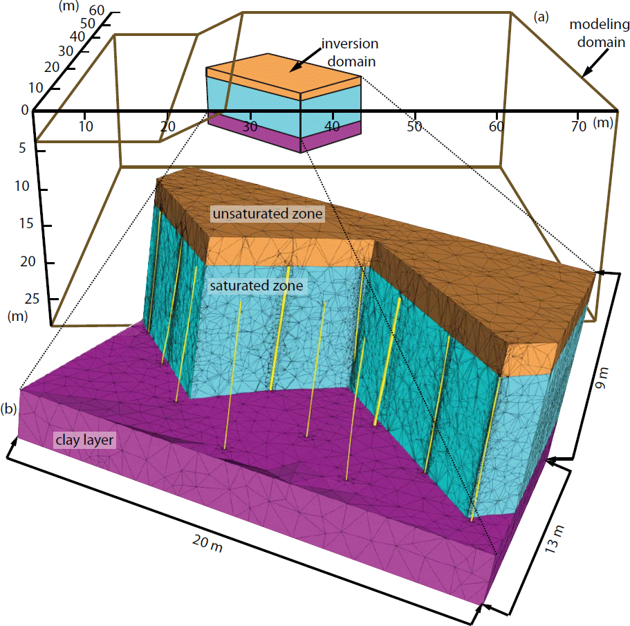
:::
::: {.column}
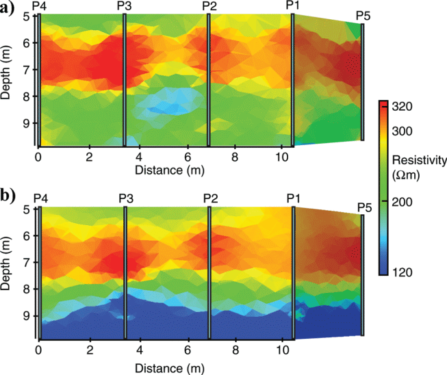
:::
::::

## Geostatistical regularization

<!-- :::: {.columns}
::: {.column}
:::
::: {.column}

:::
::::
 -->

$\vb M_{ij}=\sigma^2\exp(-3\sqrt{\frac{|x_i-x_j|}{I_x}^2+\frac{|y_i-y_j|}{I_y}^2})\quad\Rightarrow\quad \vb C=\vb M^{-0.5}$

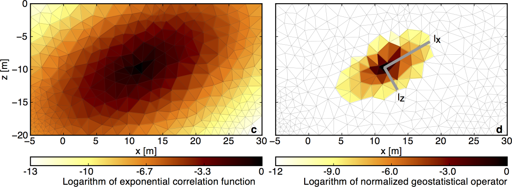
<!--  -->

## Geostatistical regularization - example

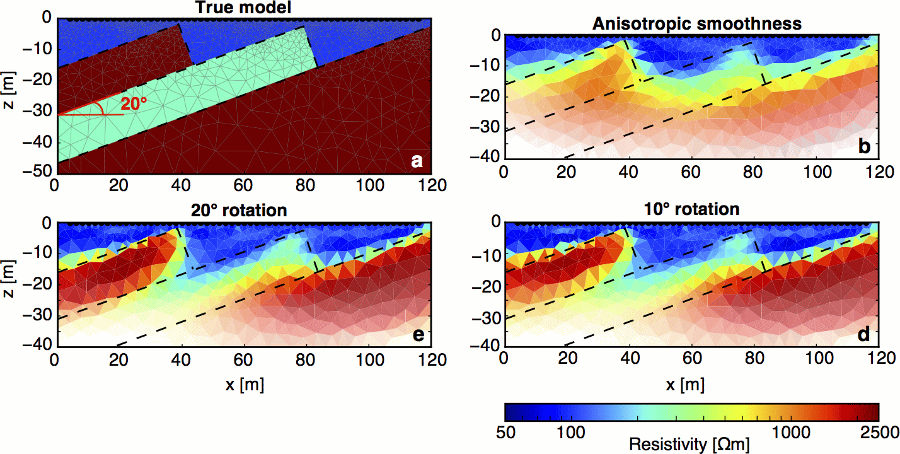

