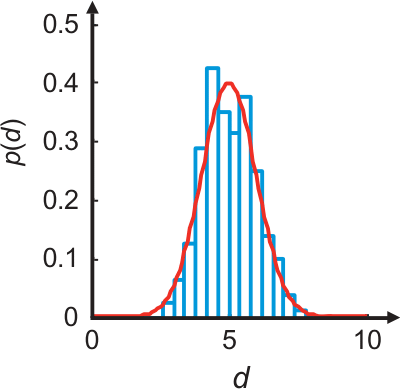
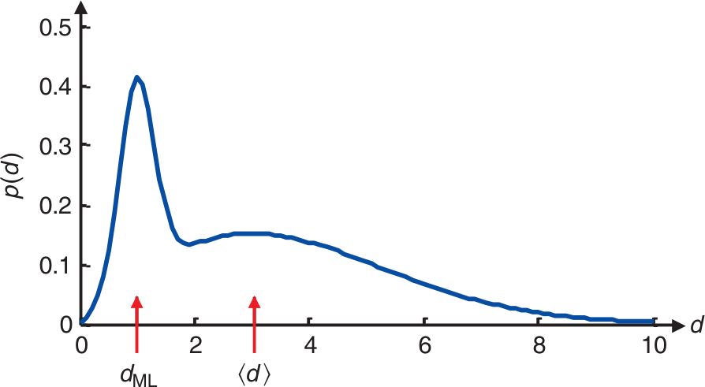
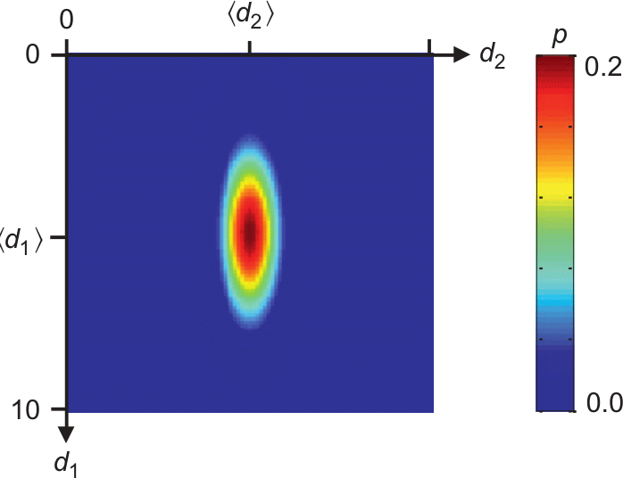
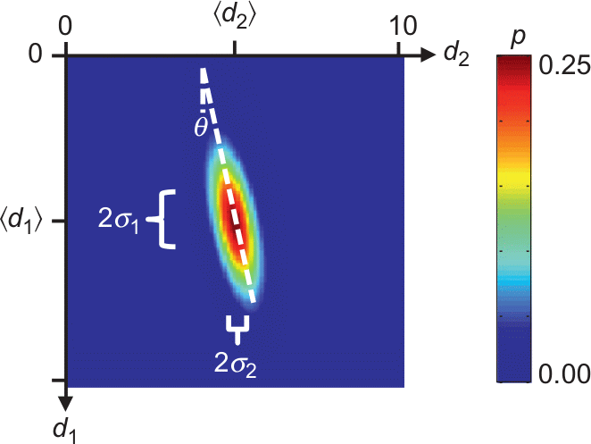
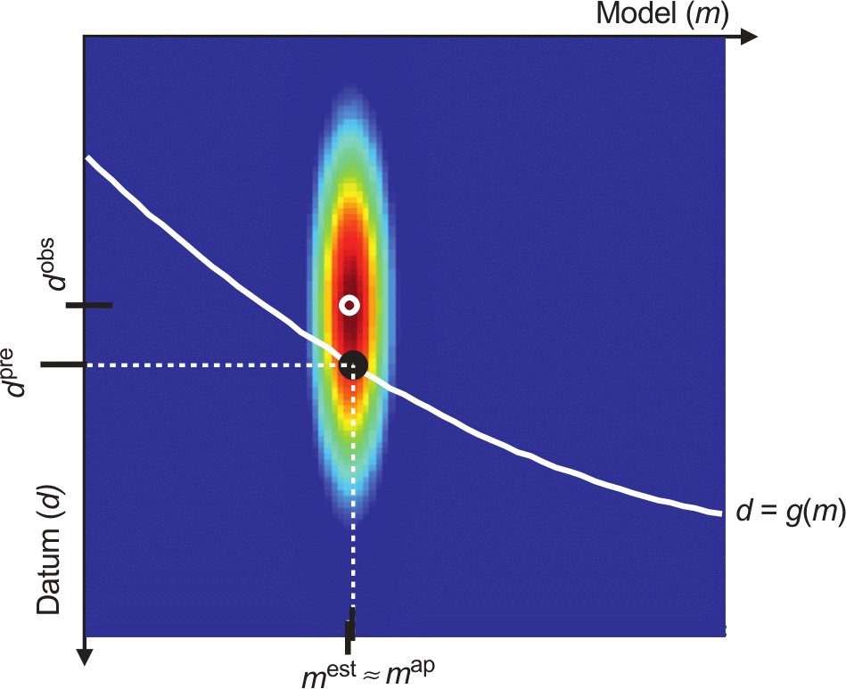
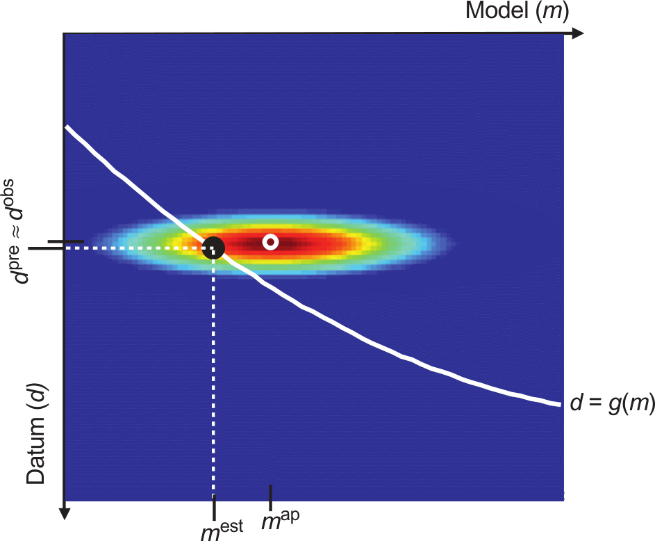
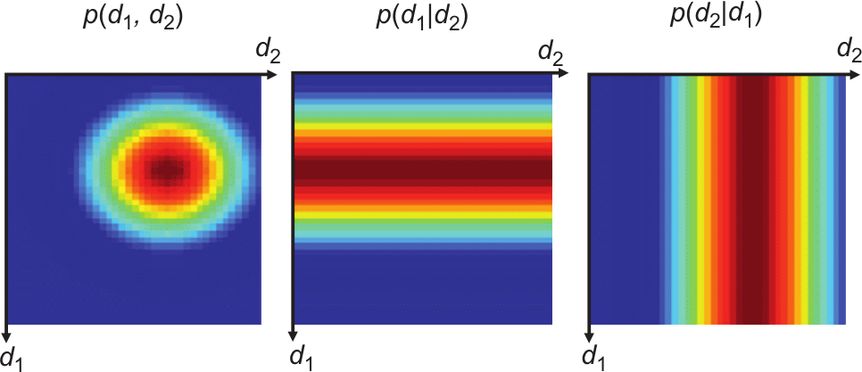
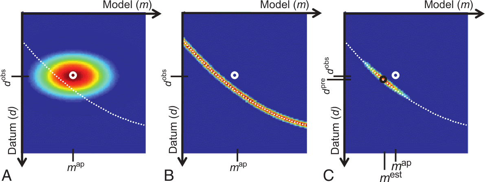
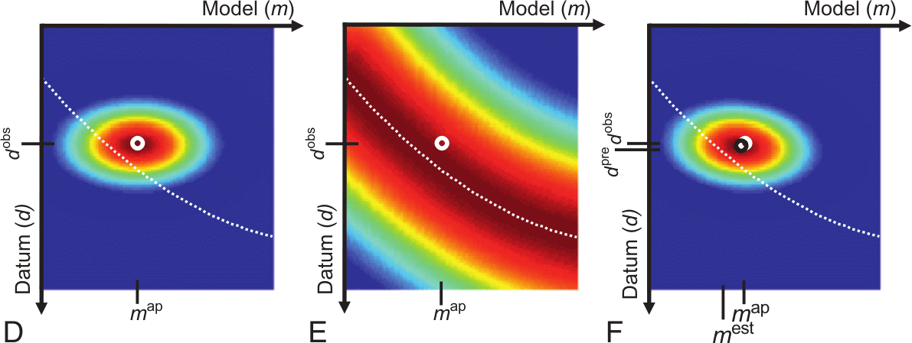
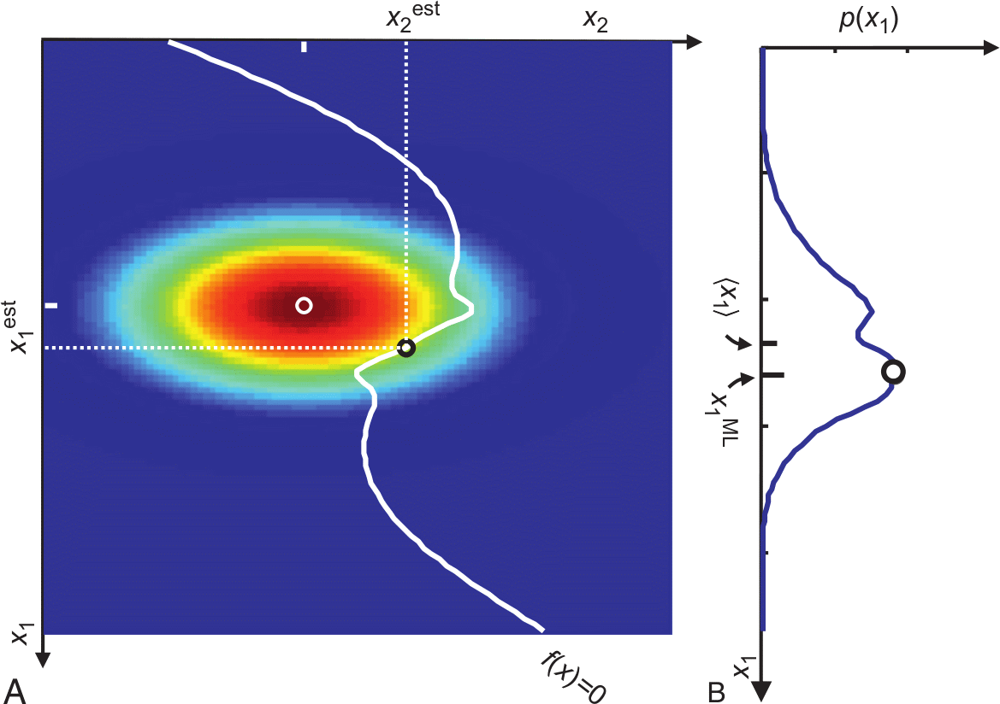

# Recap non-linear inv

:::: {.columns}
::: {.column}
**undirected (grid) search**

**directed (gradient) methods**

* Steepest descent
* Gauss-Newton method
* depend on starting model
* local damping: Marquardt
* global smoothing: Occam

:::
::: {.column}

:::
::::

# Regularization effect

$$\Phi = \Phi_d + \lambda\Phi_m$$

$\Phi_m$: difference from reference model or smoothness

How does this regularization affect convergence?

$\Rightarrow$ impact of regularization terms on objective function

## Smoothness

## Smoothness

## Smoothness

## Smoothness

## A-priori information

## A-priori information

## Wrong a-priori information

## Wrong a-priori information

# Probability and likelihood

:::: {.columns}
::: {.column}
random variables: probability through many repetitions

maximum $p(d)$ is most likely

expectation: $\expval{d}=\int d \cdot p(d) \dd{d}$
:::
::: {.column}

:::
::::

## Probability density function

:::: {.columns}
::: {.column width="80%"}

:::
::: {.column width="20%"}
$$\int p(d)\dd d=1$$
:::
::::

## Definitions

::: {.callout-important title="Probability"}
defines how probable a certain event is expected to occur

*Given a known model or system, what are the chances of a specific outcome?*
:::

::: {.callout-important title="Likelihood"}
defines probability of data under the assumption of a model (hypothesis) is true

Given an observed outcome, what is the chance that our model or system parameters are correct?
:::

::: {.callout-important title="Conditional probability"}
$P(A|B)$ Probability of A under the assumption that B occurs
:::

## Variance

$$ \sigma^2 = \int (d-\expval{d})^2 p(d) \dd{d} $$

$\sigma$ is a measure of the width of the distribution

related to standard deviation and mean of sampling

$$ \sigma^2_{est}=\frac{1}{N-1} \sum\limits_{i=1}^N (d_i - \expval{d})^2 \qq{with} \expval{d}=\frac{1}{N}\sum\limits_{i=1}^{N} d_i $$

## Data correlation

independent: $p(\vb d) = p(d_1) p(d_2)\ldots p(d_N)$

:::: {.columns}
::: {.column}

:::
::: {.column}

:::
::::

## Covariance

(measure of correlation between data)

$$ \mbox{cov}(d_1, d_2) = \int\int (d_1-\expval{d_1})(d_2-\expval{d_2}) p(d_1, d_2) \dd{d_1}\dd{d_2} $$

$$ \expval{d_i} = \int\ldots\int d_i p(\vb d) \dd{d_1}\ldots \dd{d_N} $$

## Covariance propagation

Linear problem $\vb m = \vb M \vb d$, e.g., $\vb m = \vb G^\dagger\vb d$

Mean value $\expval{\vb m}=\vb M \expval{\vb d} + \vb n$ and covariance

$$\mbox{cov}(\vb m) = \vb M \mbox{cov}(\vb d) \vb M^T$$

<!-- Covariance of linear inverse problems: $\mbox{cov}(\vb m) = \vb G^\dagger \mbox{cov}(\vb d) \vb G^\dagger ^T$ -->

Least-squares: $\vb M=(\vb G^T \vb G)^{-1} \vb G^T$,
uncorrelated data: $\mbox{cov}(\vb d)=\sigma_d^2 \vb I$

$$ \Rightarrow \mbox{cov}(\vb m) = (\vb G^T \vb G)^{-1} \vb G^T \sigma_d^2 \vb I ((\vb G^T \vb G)^{-1} \vb G^T)^T = \sigma_d^2 (\vb G^T \vb G)^{-1} $$

## A priori knowledge

:::: {.columns}
::: {.column}

:::
::: {.column}

:::
::::

## Bayes' theorem

::: {.callout-note title="Conditional probability"}
$p(a|b) = p(a, b) / p(b)$
:::

$$p(\vb m|\vb d)p(\vb d) = p(\vb d|\vb m)p(\vb m)$$

$$p(\vb m|\vb d) = \frac{p(\vb d|\vb m)p(\vb m)}{p(\vb d)}$$

posterior distribution $\propto$ likelihood x prior distribution

## Example: COVID test

* $P(T)$: probability of positive test ($T$)
* $P(I)$: probability of a person to be ill (1%) ($I$)
* $P(T|I)$: (conditional) probability of a test recognizing illness (90%)

:::{.fragment}
assume 1000 patients (1%=10 ill, 99%=990 healthy)
:::

:::{.fragment}
false tests (10%) $\Rightarrow$ 1 false negative (9 correct), 99 false positive
:::

:::{.fragment}
$$ P(I|T) = \frac{P(T|I)P(I)}{P(T)} = \frac{0.9 \cdot 0.01}{108/1000}=8.3\% $$
:::

## Example: COVID test (2)

* $P(T)$: probability of positive test ($T$)
* $P(I)$: probability of a person to be ill (1%) ($I$)
* $P(T|I)$: (conditional) probability of a test recognizing illness (99%)

:::{.fragment}
assume 10000 patients (1%=100 ill, 99%=9900 healthy)
:::

:::{.fragment}
false tests (1%) $\Rightarrow$ 1 false negative (99 correct), 99 false positive
:::

:::{.fragment}
$$ P(I|T) = \frac{P(T|I)P(I)}{P(T)} = \frac{0.99 \cdot 0.01}{198/10000}=50\% $$
:::

## FIFA example

::: {.callout-note}
Tony hears football-watching Arthur cheer. How probable is a goal being made?

1. Assumption: In 2% of the time (segments covering a cheer) there is a goal.
2. Assumption: If a goal is made by Arthurs team, he cheers by 90%.
3. Assumption: Reasons for non-goal cheers (98%) have a probability of 1%.
:::

:::{.fragment}
$$ P(G|C)=\frac{P(C|G) P(G)}{P(C|G)+P(C|-G)} = \frac{0.9 \cdot 0.02}{0.02 \cdot 0.9+0.98\cdot 0.01}=64.7\% $$
:::

## Bayes theorem simple example

<!-- joint probability $p(d_1,d_2)$, conditional probabilities $p(d_1|d_2)$ & $p(d_2|d_1)$ -->

## A priori (Menke, 2012)
::: {.r-stack}

{.fragment}

{.fragment}
:::

A: *a priori pdf* $p_a(\vb m, \vb d)$, B: *conditional pdf* $p_g(\vb m, \vb d)$, C: product $p_t(\vb m, \vb d)=p_a(\vb m, \vb d) p_g(\vb m, \vb d)$, white: theory

## A priori and likelihood

::: {.r-stack}

{.fragment}
:::

## Bayes view in nonlinear problems

## Highly nonlinear problems

<!-- ## Markow chain

$$  $$
 -->
## Monte Carlo methods

:::: {.columns}
::: {.column}

* Monte Carlos search: randomly draw solutions from grid
* accept solution only if better than old
* Markow-Chain-Monte-Carlo
* Metropolis-Hastings (Metropolis et al., 1953; Hastings, 1970)
:::
::: {.column}

:::
::::

## Simulate Annealing

:::: {.columns}
::: {.column}
Test parameter

$$ t = e^{-(\Phi(\vb m)-\Phi(\vb m^p))/T} $$

:::
::: {.column}
{.fragment}
:::
::::

## Alternatives to grid search

::: {.callout-note title="Monte Carlo search"}
draw random samples and accept them if the error is improved
:::

undirected search (Newtons method is directed)

::: {.callout-note title="Simulated annealing"}
decrease temperature controlling particle movements:

high $T$: undirected, low $T$: search in vicinity of current model
:::

## Monte Carlo vs. Simulated Annealing

:::: {.columns}
::: {.column}

:::
::: {.column}
{.fragment}
:::
::::

<!--
# Joint inversion

## Classical joint inversion

## Petrophysical joint inversion

## Structurally coupled cooperative inversion

## Cross-gradients / Gramian
 -->
