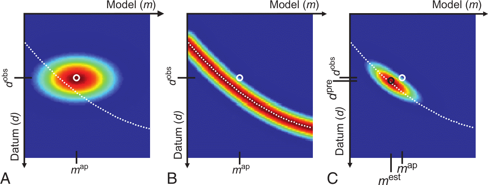
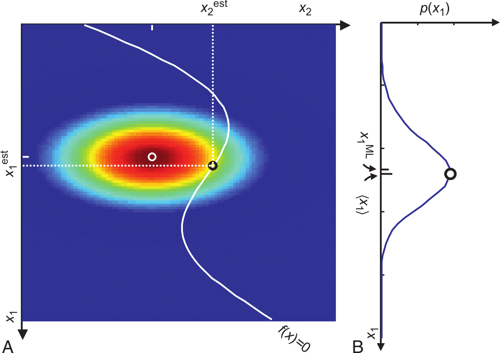

::: {.callout-note title="Bayes theorem"}
$$p(\vb m|\vb d) = \frac{p(\vb d|\vb m)p(\vb m)}{p(\vb d)}$$
:::

- $p(\vb m|\vb d)$ - posterior probability that model $\vb m$ is responsible for data
- $p(\vb d|\vb m)$ - (theoretically) likelihood that $\vb m$ is capable to generate $d$
- $p(\vb m)$ - probability that model $\vb m$ is the actual model
- $p(\vb d)$ - probability of observing $\vb d$ amongst all possible

## Data-model dependence

A: *a priori pdf* $p_a(\vb m, \vb d)$, B: *conditional pdf* $p_g(\vb m, \vb d)$, C: product $p_t(\vb m, \vb d)=p_a(\vb m, \vb d) p_g(\vb m, \vb d)$, white: theory

## Model space

::: {.columns}
::: {.column}
Bayes theorem provides another view on geophysical inversion

* trade-off between data fit (white curve) and model assumptions (color)
* represented by data errors and regularization terms/strength

:::
::: {.column}

:::
:::

## Application to constrained inversion

Gaussian likelihood function (data misfit)

$$ p(\vb d|\vb m)=\frac{1}{(2\pi)^P |D^{-1}|} \exp\left(-\frac12 \delta \vb d \vb D^T \vb D \delta \vb d\right)  $$

Prior probability function (smoothness of the model)

$$ p(\vb m)=\left(\frac{\lambda}{2\pi}\right)^{(N-1)/2} \exp(-\frac{\lambda}{2} \vb m^T \vb C^T \vb C \vb m) $$

## Smoothness

## Slightly wrong a-priori information

# Global inversion algorithms

- probabilistic background and with randomness
- good for finding global minima of objective function
- many forward runs needed (only applicable for fast $f(m)$)
- typical for small parameter sizes like curve fitting, 1D inversion

## Monte Carlo methods

:::: {.columns}
::: {.column}

* Monte Carlos search: randomly draw solutions from grid
* accept solution if better than old
* Markow chain
    $$\{\vb m^0, \vb m^1, \ldots\}$$
    - $\vb m^{k+1}$ depends only on $\vb m^k$
* Metropolis-Hastings (Metropolis et al., 1953; Hastings, 1970)
:::
::: {.column}

:::
::::

## Metropolis-Hastings algorithm

:::: {.columns}
::: {.column width="65%"}
Markov chain $P(X_{t+1}|X_1,\ldots,X_t)=P(X_{t+1}|P(X_t))$

draw candidate $Y$ from proposal distribution $q(X_t, Y)$ with probability

$$\alpha(X_t,Y)=\min \qty[ \frac{p(Y)q(Y,X_t)}{p(X_t)q(X_t,Y)} , 1 ]$$

:::
::: {.column width="35%"}

:::
::::

## Metropolis-Hastings algorithm

1. Burn-in phase: random walker is methodically guided toward the region of most probable method
1. Drawing of a candidate $\vb m'$ from a pdf $q(\vb m|\vb m')$ that approximates the posterior pdf (e.g., a Gaussian around the current state $\vb m$)
1. add candidate $\vb m'$ to Markov chain with acceptance probability
  $$\alpha=\min(1,w) \qqtext{with} w = \frac{p(\vb m')*q(\vb m|\vb m')}{p(\vb m)*q(\vb m'|\vb m)}$$
  using a random variable $u$ in the interval [0, 1] $\Rightarrow$ accept if $u>w$

## Key components

- **Proposal Distribution** ($q$): Crucial for efficiency. A good proposal distribution explores the space well without being rejected too often.
- **Acceptance Rate**: Good value (20-50%) indicates balance between exploration & exploitation. Too low = slow. Too high = stuck locally.
- **Burn-in Period**: The initial samples often discarded because the chain hasn't converged to the stationary distribution yet.
- **Thinning**: To reduce autocorrelation between samples, you can keep only every nth sample.
- **Convergence Diagnostics**: Check if chain has actually converged to the target distribution. (e.g., Gelman-Rubin statistic, trace plots).

## Trace plots

## Corner plots

::: {.columns}
::: {.column}

:::
::: {.column}
(Roudsari et al., in rev.)

* statistics of models
* correlation of parameters
* uncertainty of the results
:::
::::

##

::: {.columns}
::: {.column}

:::
::: {.column}

:::
:::

## Model variance

:::: {.columns}
::: {.column width="60%"}

:::
::: {.column width="40%"}
* derivation of mean values and standard deviations
* statistic simulations

(Tronicke et al., 2012)
:::
::::

## Application to 2D ERT/IP inversion

::: {.columns}
::: {.column}

:::
::: {.column}

:::
:::

## Simulated Annealing

:::: {.columns}
::: {.column}
Gibbs (Boltzmann) sampling
$$ P(E) = e^{-\frac{E}{k_B T}} = e^{-(\Phi(\vb m)-\Phi(\vb m^p))/T} $$

* draw models neighboring best fit
* large movements if far from target fit
* small if approaching target

:::
::: {.column}

:::
::::

## Bio-inspired global search methods

- Genetic Algorithm
- Evolution Strategy
- Differential Evolution Algorithm
- Estimation of Distribution Algorithm
- Particle Swarm Optimization
- Ant Colony Optimization
- Pareto Archived Evolution Strategy (PAES)
- Nondominated Sorting Genetic Algorithm (NSGA-II)

## Genetic algorithms

:::: {.columns}
::: {.column width="55%"}

:::
::: {.column width="45%"}
* inspired by evolution of species (*survival of the fittest*)
* code models in a binary (DNA) sequence
* randomly generate initial population
* let the fittest (data fit!) survive & mate and the unfittest die
* mutation of the DNA to create variability
:::
::::

## Nondominated Sorting Genetic Algorithm

:::: {.columns}
::: {.column}

:::
::: {.column}
* minimization of two objective functions
  - two geophysical methods
  - data misfit and model roughness
* Pareto front: all non-dominated individuals
* sort Pareto rank and play god
:::
::::

## Particle swarm optimization

:::: {.columns}
::: {.column}
* movements of individuals in swarm (impulse & attraction)
* individual position ($\vb m$) & velocity

:::
::: {.column}
* distribute population over range
* acceleration from attraction
* move with velocity

:::
::::

## Summary

global (probabilistic) inversion methods

- can overcome local minimum problems
- also find a trade-off between data fit and model assumptions
- find a variety of models fitting the data
- can therefore show correlation and model uncertainty
- only applicable to "small" problems (increasingly simple 2D)
- well suited as supplement to local methods

